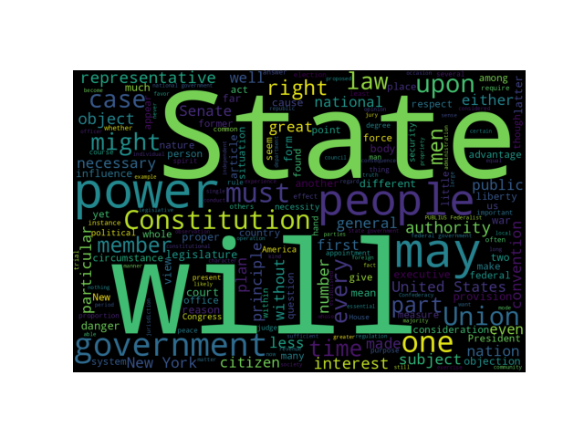

#+title: Text Analysis of Federalist Papers

This coding project is designed to help students learn about webscraping and frequency analysis of text. It is designed to be cross curricular and to be used in conjunction with an American History class. The code examples below have been modified to make this document easier to read and will not run. The full [[./Text-Analysis][source code]] is available in GitHub. 

* A Brief Overview
Students will scan through the text of the federalist papers and count the frequency of words. The goal is to analyze the most common to words to identify themes throughout papers.

** Grade Level
High School Students with at least one year of American History.
** Programming Skills Addressed
- web scraping
- reading from and writing to files
- looping
- 3rd party modules
** Standard Alignment
*** CSTA Student Standards
3A-AP-17 (Grades 9-10): Decompose problems into smaller components through systematic analysis, using constructs such as procedures, modules, and/or objects.

*** CSTA Teacher Standards
Standard 4 Instructional Design d. Build connections between CS and other disciplines — Design learning experiences that make connections to other disciplines and real-world contexts.

  
* The Project
First, access the federalist papers from the [[https://guides.loc.gov/federalist-papers/full-text][library of congress]]. Students must recognize that the URLs have a consistent patter. Scraping the full text of all 85 papers and storing in a text file is achieved with the following.

#+begin_src python
import requests
from bs4 import BeautifulSoup

sources = [
    "https://guides.loc.gov/federalist-papers/text-1-10",
    ...
    "https://guides.loc.gov/federalist-papers/text-81-85",
]

for s in sources:
    source = requests.get(s).text
    soup = BeautifulSoup(source, "lxml")

    with open("federalist_papers.txt", "a") as f:
        for paper in soup.find_all("div", class_="s-lib-box s-lib-box-std"):
            title = paper.h2.text
            if title != "Table of Contents ":
                f.write(title)
                for para in paper.find_all("p"):
                    f.write(para.text + "\n\n")
                f.write("-" * len(title) + "\n\n")
#+end_src

Now that we have the full text, we need to Then I created a word counter that filters out [[file:Text-Analysis/wordlist.txt][stop words]] such as "the" or "a". These types of words are the most common, but do not add value for our context.

#+begin_src python :results True exports: output
from collections import Counter
from pprint import pprint as pp

def get_stopwords(stopwords="./Text-Analysis/wordlist.txt"):
    with open(stopwords) as f:
        return [word.strip() for word in f.readlines()]

def word_counter(filename):
    stopwords = get_stopwords()
    with open(filename) as f:
        word_counts = Counter()
        for line in f.readlines():
            word_counts.update(
                word.strip(".,()")
                for word in line.lower().split()
                if word.strip("().,") not in stopwords)

    print(f"The most common words found in {filename} are:")
    pp(word_counts.most_common(30))

word_counter("./Text-Analysis/federalist_papers.txt")
#+end_src

Then create a word cloud. A third party module makes this incredible simple.

#+begin_src python
from matplotlib import pyplot as plt
from wordcloud import STOPWORDS, WordCloud

def word_cloud_generator(filename):
    with open(filename, "r") as text:
        text_string = " ".join(line for line in text)

    wordcloud = WordCloud(width=1200, height=800, stopwords=STOPWORDS).generate(
        text_string
    )
    plt.axis("off")
    plt.savefig(f"{filename[:-4]}_word_cloud.png", format="png")
#+end_src

This generates the following word cloud.

* Reflection

*What did you create and why?*

I created a coding project. When I was first learning to webscrape, I became very excited. I thought about how I could use it in the classroom and see if I could connect it to other disciplines. Part of the vision of the program we ran at my previous school was to incorporate computer science into all core classes. This is one possible way to do that.

How does your project connect to concepts from this course?

This project fits nicely into module 5, coding and programming. It is written in Python and can be achieved with beginner to intermediate coders. The teacher can adjust the level of difficulty depending on the skill level of the students. For more beginners, this project can be done together leveraging screen casts. For more advanced students, outlining the project and agreeing upon an end product can be done together, but then students can code it on their own.

*How could this project support student learning?*

This supports student learning by providing a context for students to utilize their coding skills. To do this by hand would be painstakingly tedious. This motivates the need to use code. Instead of running isolated exercises on web scraping, reading from and writing to files, looping, and 3rd party modules, students are putting those into action with a concrete end goal in mind. It helps increase retention for the individual skills.

Second, it offers practice with abstraction and pattern recognition. In particular, identifying that the Federalist papers URLs are stored in a consistent pattern helps save a lot of work.

Finally, it offers cross-curricular reinforcement. The use of primary-source documents supports what they should be doing in their English language arts and social studies courses.

*How has your understanding of computer science evolved during this course?*

The biggest change in understanding was module 3. It is the content I am the least familiar with. As I mentioned in one of the discussions, I am sure that I have seen this content before, but I have not retained it. As I begin teaching the computer science course at the high school level, I will continue to engage in my own learning so that I can support students. I did appreciate the information in module one. Problem-solving and critical thinking skills are going to be increasingly important as we move forward in the era of artificial intelligence.

*How standards connect.*

The student standard identified is, 3A-AP-17 (Grades 9-10): Decompose problems into smaller components through systematic analysis, using constructs such as procedures, modules, and/or objects. This is connected as evidenced by the use of functions. Each function name helps to identify the discrete sub-problems that make up the project.

The teacher standard identified is, 4d: Build connections between CS and other disciplines — Design learning experiences that make connections to other disciplines and real-world contexts. I believe that this is self-evident because we are taking a computer science coding project and incorporating content from social studies. Students are utilizing primary source documents and identifying themes within them; however, we are using computer science as the tool to do that analysis.

📚
